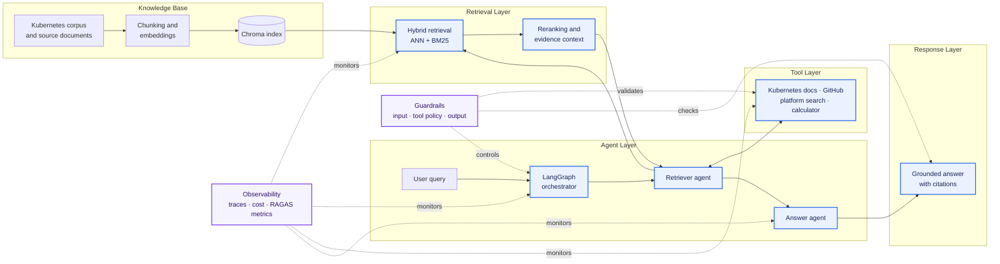

# Kubernetes Multi-Agent AI System

## Overview

This is a production-style multi-agent AI system for answering Kubernetes and platform-infrastructure questions. Specialized agents coordinate retrieval, orchestration, grounded answer generation, and evaluation to handle each request end to end.

The platform includes input and output guardrails, source-backed responses, cost and model tracing, request-level observability, and RAGAS quality metrics. It demonstrates the security, reliability, and observability patterns organizations need when operating AI systems at scale.

Live at [5hort.site](https://5hort.site).

## Architecture diagram 

The system turns curated Kubernetes knowledge and optional tool results into guarded, observable answers.

- **Corpus / Knowledge Base:** Curated source documents are chunked, embedded, and stored in Chroma.
- **Retrieval:** Hybrid ANN and BM25 search is fused and reranked into relevant evidence.
- **Agents:** LangGraph coordinates retrieval, tool selection, fallback behavior, and answer generation.
- **Tools:** Allow-listed documentation, GitHub, platform-search, and calculator tools extend the workflow.
- **Answer Layer:** Claude produces a streamed response grounded in evidence with source citations.
- **Guardrails:** Input scope, tool policy, and output checks enforce relevant and safe behavior.
- **Observability:** Langfuse traces requests, steps, model cost, and quality signals alongside RAGAS metrics.

[View the detailed request-flow diagram](docs/architecture/request-flow.svg) or read the [deployment architecture](docs/ARCHITECTURE.md).

## Prerequisites

- **Local tools:** Git, Python 3.12+, Docker, `kubectl`, Helm, Helmfile, Terraform, and the AWS CLI.
- **API keys:** An Anthropic API key is required. Langfuse project keys are required for tracing; a GitHub token is recommended for reliable Kubernetes repository lookups.
- **Accounts:** GitHub and AWS accounts with access to ECR, EKS, IAM, Secrets Manager, and the required Terraform state resources.
- **Deployment access:** A Kubernetes context for the target cluster and control of a domain or DNS zone when exposing the public services.
