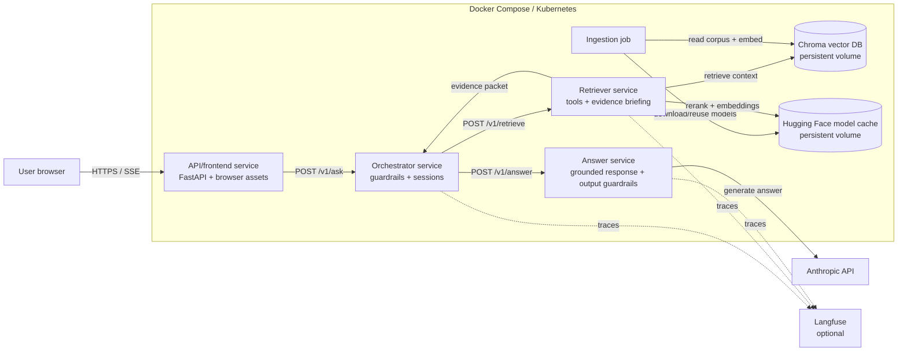

# Web deployment architecture

The services have separate images and dependency manifests: the public API/frontend does not contain agent implementations or model credentials; the orchestrator does not contain Chroma, embedding, reranking, answer implementation, or browser assets; the retriever owns retrieval/tools; and the answer service owns answer prompting and output guardrails. Their internal HTTP contracts are tested independently. The in-process graph remains only for local development when neither internal agent URL is configured.
