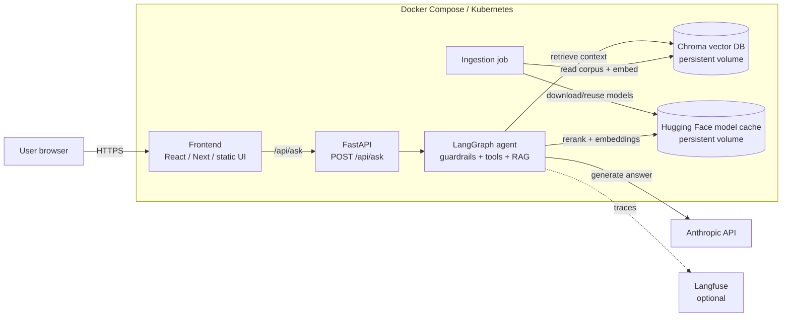

# Web deployment architecture

```mermaid
flowchart LR
    U[User browser]

    subgraph Docker Compose / Kubernetes
        FE[Frontend<br/>React / Next / static UI]
        API[FastAPI<br/>POST /api/ask]
        AGENT[LangGraph agent<br/>guardrails + tools + RAG]
        CHROMA[(Chroma vector DB<br/>persistent volume)]
        MODELS[(Hugging Face model cache<br/>persistent volume)]
        INGEST[Ingestion job]
    end

    ANTHROPIC[Anthropic API]
    LANGFUSE[Langfuse<br/>optional]

    U -->|HTTPS| FE
    FE -->|/api/ask| API
    API --> AGENT
    AGENT -->|retrieve context| CHROMA
    AGENT -->|generate answer| ANTHROPIC
    AGENT -. traces .-> LANGFUSE

    INGEST -->|read corpus + embed| CHROMA
    INGEST -->|download/reuse models| MODELS
    AGENT -->|rerank + embeddings| MODELS
```
