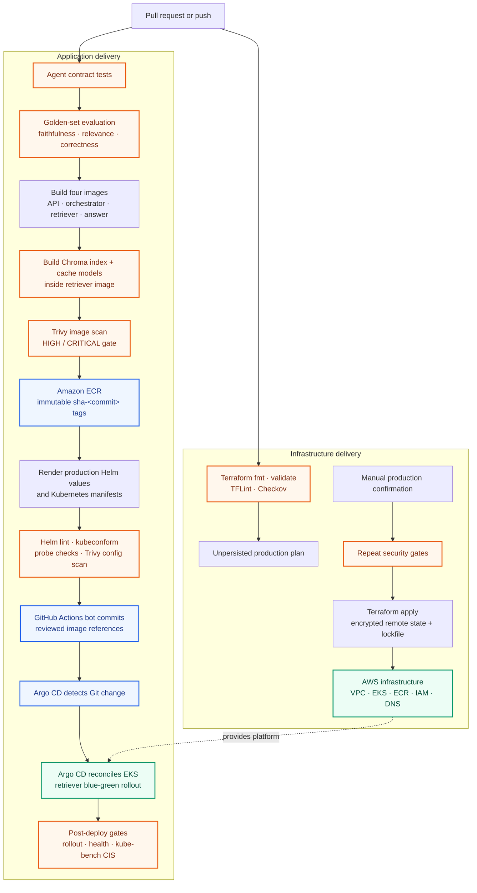

# CI/CD architecture

KubeMind uses gated image promotion and GitOps deployment for application changes, with a separate manually approved Terraform path for infrastructure changes.

## Application pipeline

1. **Test and evaluate:** [`agent-deploy.yml`](../.github/workflows/agent-deploy.yml) runs the complete test suite. Pushes to `main` and release tags also rebuild the retrieval index, run the five-case golden set, require all cases to score, and enforce average faithfulness, relevance, and correctness of at least `0.85`.
2. **Build and scan:** After the agent workflow succeeds, [`image-deploy.yml`](../.github/workflows/image-deploy.yml) builds the four service images in parallel and blocks images with high or critical Trivy findings. The retriever build embeds the corpus index and caches both local ranking models so production pods do not perform six minutes of indexing or cold model downloads.
3. **Promote immutable images:** Successful non-PR builds assume a narrowly scoped AWS role through GitHub OIDC and push `sha-<commit>` images to ECR. Release commits also receive their matching `v*` tag.
4. **Validate manifests:** [`manfests-scan-push.yml`](../.github/workflows/manfests-scan-push.yml) renders the production image references, runs Helm lint, validates schemas with kubeconform, verifies required health probes, and scans for high or critical configuration findings.
5. **Deploy through GitOps:** The workflow commits only the reviewed production image references to `main`. Argo CD observes that commit and reconciles the workloads into EKS. Argo Rollouts keeps the active retriever serving while a preview revision copies its pod-local index and warms its models, then atomically switches the active Service after readiness succeeds.
6. **Verify production:** The final job waits for the three Deployments and the healthy retriever Rollout, checks the API health endpoint, runs kube-bench CIS checks, uploads evidence, and removes the temporary privileged scanner.

Pull requests run tests and image scans but do not push images or deploy. Scan reports, rendered manifests, evaluation results, and CIS output are retained as workflow artifacts for review.

## Infrastructure pipeline

[`terraform-plan.yml`](../.github/workflows/terraform-plan.yml) runs formatting, validation, TFLint, and Checkov for Terraform changes. Non-PR runs also create an unpersisted production plan using a dedicated AWS role.

Infrastructure changes are applied only through the manually dispatched [`terraform-push.yml`](../.github/workflows/terraform-push.yml) workflow with explicit confirmation. It repeats the security gates, assumes the Terraform role through GitHub OIDC, and applies against encrypted S3 state with native lockfile locking.

## Delivery controls

- GitHub Actions are pinned to immutable commit SHAs.
- Production jobs use protected GitHub environments and short-lived OIDC credentials.
- ECR promotion, Terraform changes, and cluster verification use separate IAM roles.
- Application images are referenced by immutable commit tags rather than `latest`.
- High and critical image, manifest, or Terraform findings stop promotion.
- Argo CD, rather than CI credentials, owns long-lived application reconciliation.
